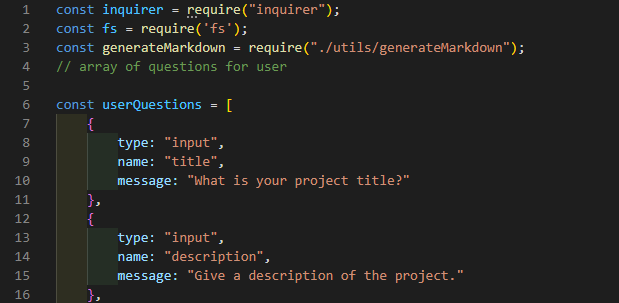

# GoodReadme_Generator
  
  ## Description 
  A command line application that generates a professional README.md from the user's input using Node.
  ## Table of Contents:
  - [Installation](#Installation)
  - [Usage](#Usage)
  - [License](#License)
  - [Contributing](#Contributing)
  - [Tests](#Tests)
  - [Questions](#Questions)
  ## Installation
  Having Node installed, write "npm i" into the command line to install all dependencies."
  ## Usage
  User answers prompt questions.  The input data is then used to generate a professional readme document for projects.
  - Requires inquirer. Using inquirers type,name, and message, I set up the prompts to get the information needed to create a professional readme.
 
 
  
  ## License
  MIT
  ## Contributing
  
  ## Tests
  
  ## Questions
  For any questions, [mailto:alexisayyid@gmail.com], or visit my [GitHub] (https://github.com/aisayyid) 
  
  https://drive.google.com/file/d/1K4SrPjkElYfdyFFaDpUtOKhSgmtmSrVn/view
